# Dokumentacja Projektu

## Spis Treœci
1. [Opis Projektu](#opis-projektu)
2. [Autorzy](#autorzy)
3. [Wymagania Systemowe](#wymagania-systemowe)
4. [Konfiguracja Projektu](#konfiguracja-projektu)
   1. [Krok 1: Klonowanie Repozytorium](#krok-1-klonowanie-repozytorium)
   2. [Krok 2: Konfiguracja Bazy Danych](#krok-2-konfiguracja-bazy-danych)
   3. [Krok 3: Przygotowanie Bazy Danych](#krok-3-przygotowanie-bazy-danych)
   4. [Krok 4: Uruchomienie Aplikacji](#krok-4-uruchomienie-aplikacji)
5. [Struktura Projektu](#struktura-projektu)
   1. [Foldery i Pliki](#foldery-i-pliki)
   2. [Modele](#modele)
6. [Opis Dzia³ania Aplikacji](#opis-dzia³ania-aplikacji)
   1. [Rejestracja i Logowanie](#rejestracja-i-logowanie)
   2. [Zarz¹dzanie U¿ytkownikami](#zarz¹dzanie-u¿ytkownikami)
   3. [Zarz¹dzanie Grupami](#zarz¹dzanie-grupami)
   4. [Zarz¹dzanie Lekcjami](#zarz¹dzanie-lekcjami)
   5. [Zarz¹dzanie Ankietami](#zarz¹dzanie-ankietami)
   6. [Formularze Kontaktowe](#formularze-kontaktowe)
   7. [Eksportowanie Lekcji](#eksportowanie-lekcji)]

## Opis Projektu
Projekt jest aplikacj¹ webow¹ opart¹ na technologii ASP.NET Core Blazor, która umo¿liwia zarz¹dzanie u¿ytkownikami, grupami, lekcjami oraz ankietami. Aplikacja wykorzystuje ASP.NET Core Identity do zarz¹dzania u¿ytkownikami i rolami.

## Autorzy
- Tomasz Kryœ
- Sebastian Koz³owski

## Wymagania Systemowe
- .NET 8 SDK
- SQL Server
- Visual Studio 2022 (lub inny kompatybilny edytor kodu)

## Konfiguracja Projektu

### Krok 1: Klonowanie Repozytorium
Skopiuj repozytorium na swój lokalny komputer:

```bash
git clone https://github.com/TwojeRepozytorium/Projekt-programowanie.git
cd Projekt-programowanie
```

### Krok 2: Konfiguracja Bazy Danych
Upewnij siê, ¿e masz zainstalowany SQL Server. Skonfiguruj po³¹czenie z baz¹ danych w pliku appsettings.json:

```json
{
  "ConnectionStrings": {
    "DefaultConnection": "Server=(localdb)\\mssqllocaldb;Database=ProjektProgramowanie;Trusted_Connection=True;MultipleActiveResultSets=true"
  },
  "Logging": {
    "LogLevel": {
      "Default": "Information",
      "Microsoft.AspNetCore": "Warning"
    }
  },
  "AllowedHosts": "*"
}
```

### Krok 3: Przygotowanie Bazy Danych
Uruchom migracje, aby utworzyæ schemat bazy danych:
```bash
dotnet ef database update
```

### Krok 4: Uruchomienie Aplikacji
Uruchom aplikacjê z poziomu GUI b¹dŸ komend¹:
```bash
dotnet run
```

## Struktura Projektu

### Foldery i Pliki
- **Controllers/**: Zawiera kontrolery MVC, które obs³uguj¹ logikê aplikacji i zarz¹dzaj¹ widokami.
- **Data/**: Zawiera kontekst bazy danych (`ApplicationDbContext`) oraz metody seeda, które inicjalizuj¹ dane w bazie danych.
- **Models/**: Zawiera modele danych u¿ywane w aplikacji, które reprezentuj¹ obiekty i struktury danych.
- **Views/**: Zawiera widoki Razor Pages, które s¹ u¿ywane do renderowania interfejsu u¿ytkownika.
- **wwwroot/**: Zawiera statyczne pliki, takie jak CSS, JavaScript, obrazy itp., które s¹ wykorzystywane w aplikacji.
- **Program.cs**: G³ówny plik uruchamiaj¹cy aplikacjê, który konfiguruje us³ugi i uruchamia aplikacjê.
- **appsettings.json**: Plik konfiguracyjny aplikacji, w którym przechowywane s¹ ustawienia po³¹czenia z baz¹ danych oraz inne parametry konfiguracyjne.

### Kontrolery
- **HomeController**: Odpowiada za obs³ugê g³ównych stron aplikacji, takich jak strona g³ówna i strona prywatnoœci. Zawiera równie¿ akcje do zarz¹dzania u¿ytkownikami.
- **AccountController**: Odpowiada za zarz¹dzanie kontami u¿ytkowników, w tym rejestracjê, logowanie, edycjê profilu, zmianê has³a oraz usuwanie konta.
- **SurveyController**: Odpowiada za zarz¹dzanie ankietami, w tym tworzenie, wyœwietlanie, usuwanie oraz przegl¹danie szczegó³ów ankiet.
- **ContactFormController**: Odpowiada za obs³ugê formularzy kontaktowych, w tym wyœwietlanie formularza, wysy³anie wiadomoœci oraz przegl¹danie listy przes³anych formularzy.
- **GroupsController**: Odpowiada za zarz¹dzanie grupami, w tym tworzenie, edycjê, usuwanie oraz wyœwietlanie listy grup.
- **SchedulerController**: Odpowiada za zarz¹dzanie harmonogramem lekcji, w tym tworzenie, edycjê, usuwanie oraz wyœwietlanie lekcji. Zawiera równie¿ funkcje do eksportowania lekcji do formatu iCalendar.

### Modele
- **ApplicationUser**: Reprezentuje u¿ytkownika aplikacji, zawiera dane takie jak nazwa u¿ytkownika, adres e-mail, imiê, nazwisko, adres zamieszkania oraz inne informacje powi¹zane z u¿ytkownikiem.
- **Group**: Reprezentuje grupê, zawiera dane takie jak nazwa grupy, identyfikator nauczyciela oraz listê studentów przypisanych do grupy.
- **Lesson**: Reprezentuje lekcjê, zawiera dane takie jak tytu³ lekcji, czas rozpoczêcia i zakoñczenia, opis oraz identyfikator grupy, do której lekcja nale¿y.
- **Survey**: Reprezentuje ankietê, zawiera dane takie jak identyfikator lekcji, identyfikator studenta, ocena kursu oraz rekomendacja.
- **ContactForm**: Reprezentuje formularz kontaktowy, zawiera dane takie jak tytu³, treœæ oraz adres e-mail nadawcy.
- **GroupEditViewModel**: Reprezentuje model widoku edycji grupy, zawiera dane takie jak identyfikator grupy, nazwa grupy, identyfikator nauczyciela, lista wybranych studentów oraz listy nauczycieli i studentów do wyboru.
- **LoginViewModel**: Reprezentuje model widoku logowania, zawiera dane takie jak adres e-mail, has³o oraz opcjê zapamiêtania u¿ytkownika.
- **RegisterViewModel**: Reprezentuje model widoku rejestracji, zawiera dane takie jak imiê, nazwisko, adres, adres e-mail, has³o, potwierdzenie has³a oraz rolê u¿ytkownika.
- **SurveyViewModel**: Reprezentuje model widoku ankiety, zawiera dane takie jak identyfikator lekcji, identyfikator studenta, ocena kursu oraz rekomendacja.
- **UserListViewModel**: Reprezentuje model widoku listy u¿ytkowników, zawiera listê u¿ytkowników oraz s³ownik ról u¿ytkowników.
- **UserWithRolesViewModel**: Reprezentuje model widoku u¿ytkownika z rolami, zawiera dane takie jak identyfikator u¿ytkownika, imiê, nazwisko, adres e-mail, adres zamieszkania, data utworzenia konta oraz listy ról u¿ytkownika.

### Widoki
- **Home/Index.cshtml**: Widok strony g³ównej aplikacji.
- **Home/Privacy.cshtml**: Widok strony prywatnoœci.
- **Account/Register.cshtml**: Widok formularza rejestracji nowego u¿ytkownika.
- **Account/Login.cshtml**: Widok formularza logowania.
- **Account/Edit.cshtml**: Widok formularza edycji profilu u¿ytkownika.
- **Account/Detail.cshtml**: Widok szczegó³ów profilu u¿ytkownika.
- **Account/Delete.cshtml**: Widok formularza usuwania konta u¿ytkownika.
- **Survey/Create.cshtml**: Widok formularza tworzenia nowej ankiety.
- **Survey/Index.cshtml**: Widok listy ankiet.
- **Survey/Detail.cshtml**: Widok szczegó³ów ankiety.
- **ContactForm/Index.cshtml**: Widok formularza kontaktowego.
- **ContactForm/List.cshtml**: Widok listy przes³anych formularzy kontaktowych.
- **Groups/Index.cshtml**: Widok listy grup.
- **Groups/Edit.cshtml**: Widok formularza edycji grupy.
- **Groups/Delete.cshtml**: Widok formularza usuwania grupy.
- **Groups/Create.cshtml**: Widok formularza tworzenia nowej grupy.
- **Scheduler/Index.cshtml**: Widok harmonogramu lekcji.

## Opis Dzia³ania Aplikacji

### Rejestracja i Logowanie

W aplikacji proces rejestracji jest dostêpny tylko dla administratorów. 

- **Rejestracja:**  
  Aby zarejestrowaæ nowego u¿ytkownika, nale¿y przejœæ do formularza rejestracji, dostêpnego tylko dla administratora. W formularzu wymagane s¹ dane, takie jak imiê, nazwisko, adres e-mail, has³o, adres zamieszkania oraz rola u¿ytkownika. Po wype³nieniu formularza administrator mo¿e utworzyæ konto. U¿ytkownik zostaje automatycznie przypisany do roli, adres email jest ju¿ potwierdzony.

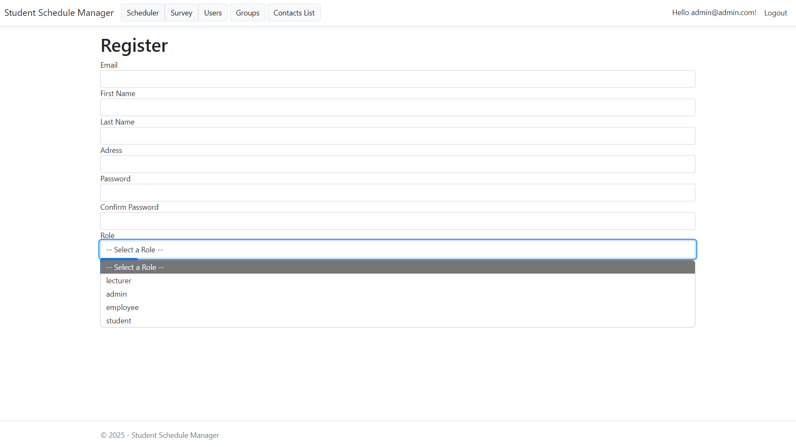

- **Logowanie:**  
  U¿ytkownicy mog¹ logowaæ siê, podaj¹c swój e-mail i has³o. Jeœli dane s¹ poprawne, u¿ytkownik zostaje zalogowany i przekierowany na stronê g³ówn¹. 

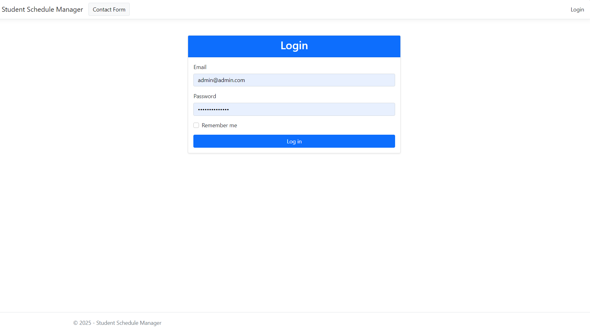

- **Uwaga:** Rejestracja nowych u¿ytkowników jest dostêpna tylko dla administratorów aplikacji.


### Zarz¹dzanie U¿ytkownikami

Administratorzy maj¹ pe³ne uprawnienia do zarz¹dzania u¿ytkownikami w aplikacji. Mog¹:

- **Przegl¹danie listy u¿ytkowników** – Administratorzy mog¹ przegl¹daæ wszystkich u¿ytkowników zarejestrowanych w aplikacji oraz szczegó³y ich kont (imiê, nazwisko, adres e-mail, adres, data rejestracji).
  
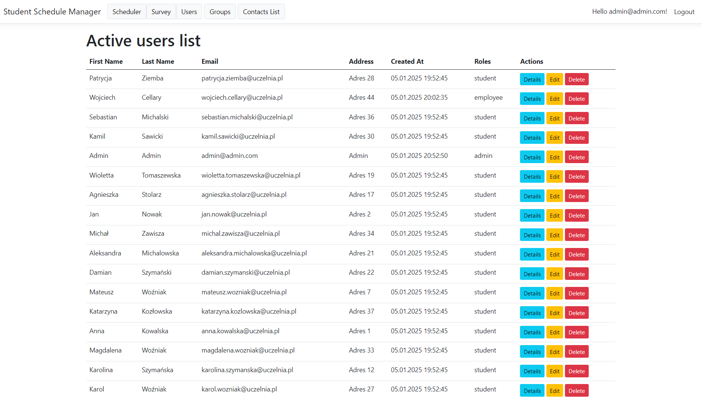
- **Edytowanie danych u¿ytkowników** – Administratorzy mog¹ edytowaæ dane u¿ytkowników, takie jak imiê, nazwisko, e-mail, adres, oraz przypisywaæ im odpowiednie role.

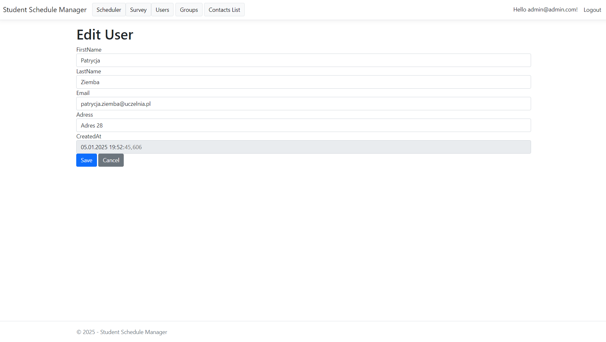
- **Przypisywanie ról** – Administratorzy maj¹ mo¿liwoœæ przypisywania ról u¿ytkownikom, co determinuje ich uprawnienia w aplikacji (np. student, wyk³adowca, pracownik).
  
- **Usuwanie kont u¿ytkowników** – Administratorzy mog¹ usuwaæ konta u¿ytkowników, co powoduje ich trwa³e usuniêcie z systemu.

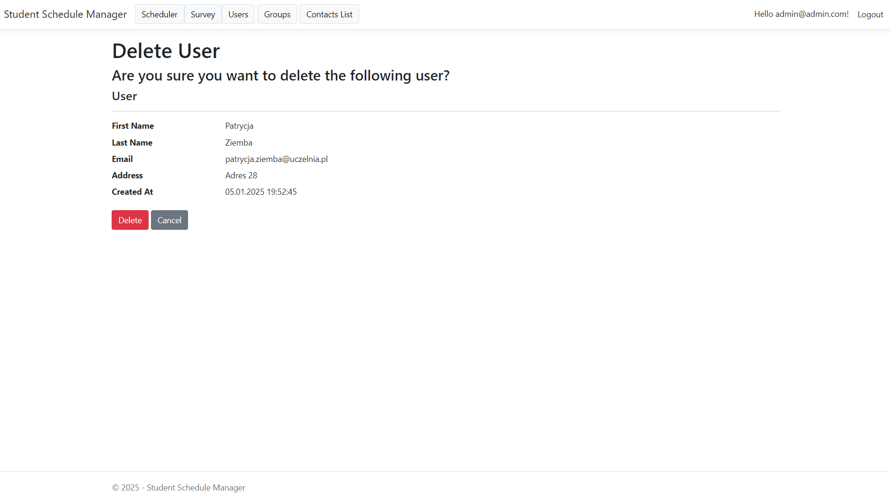


### Zarz¹dzanie Grupami
Administratorzy i pracownicy mog¹ tworzyæ, edytowaæ i usuwaæ grupy. Ka¿da grupa ma przypisanego nauczyciela oraz listê studentów. U¿ytkownicy mog¹ przegl¹daæ listê grup oraz szczegó³y poszczególnych grup.

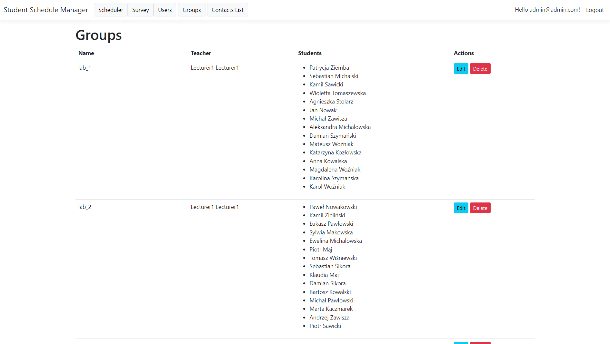

### Zarz¹dzanie Lekcjami
Administratorzy, pracownicy i wyk³adowcy mog¹ tworzyæ, edytowaæ i usuwaæ lekcje. Ka¿da lekcja ma przypisany tytu³, czas rozpoczêcia i zakoñczenia, opis oraz grupê, do której nale¿y. U¿ytkownicy mog¹ przegl¹daæ harmonogram lekcji oraz szczegó³y poszczególnych lekcji.

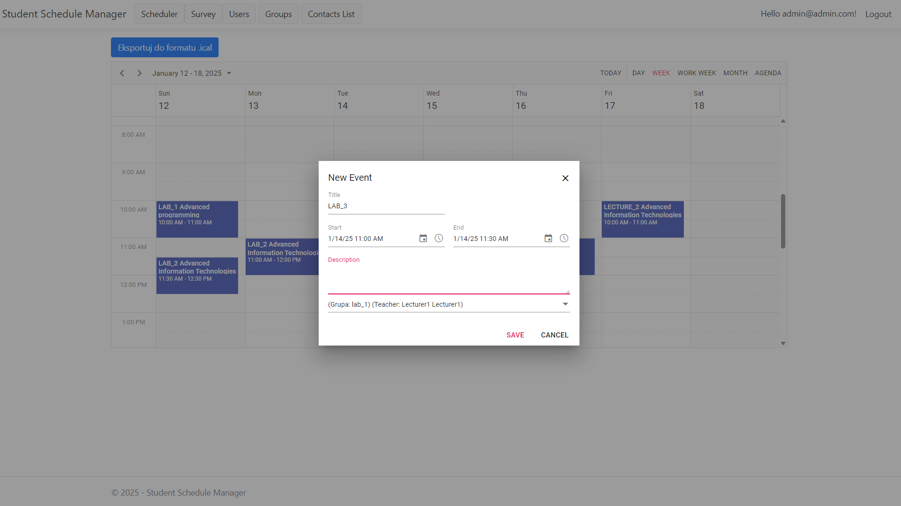
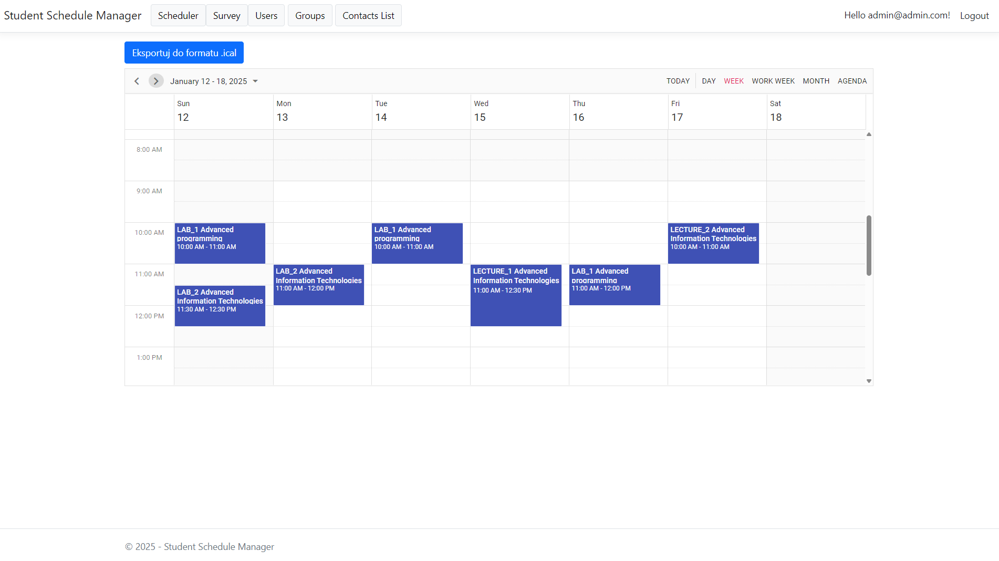
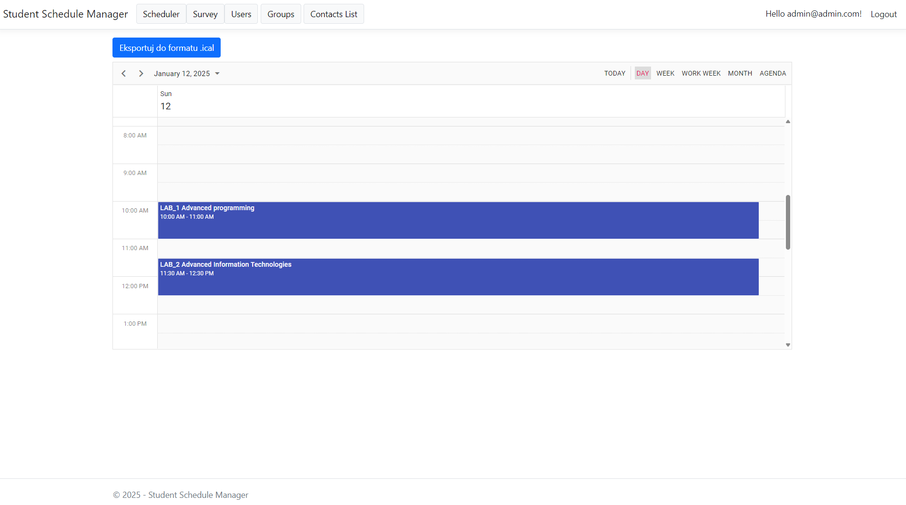
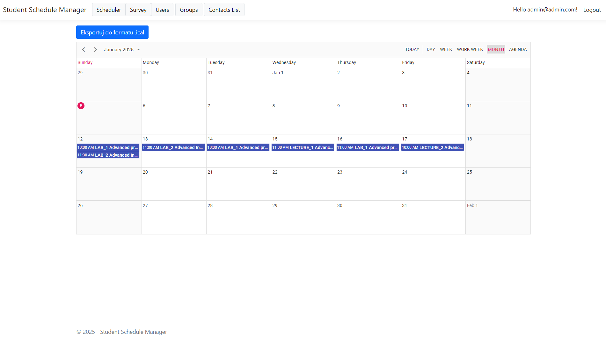
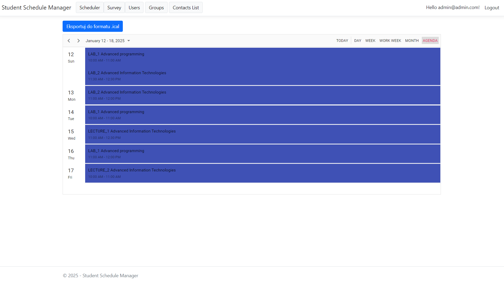


### Zarz¹dzanie Ankietami
Studenci mog¹ tworzyæ ankiety po zakoñczonych zajêciach, oceniaj¹c kursy i dodaj¹c rekomendacje. Administratorzy mog¹ przegl¹daæ listê ankiet oraz szczegó³y poszczególnych ankiet. Studenci mog¹ przegl¹daæ tylko swoje ankiety.

### Formularze Kontaktowe
NIezarejestrowani u¿ytkownicy mog¹ wysy³aæ formularze kontaktowe, podaj¹c tytu³, treœæ oraz adres e-mail. Administratorzy mog¹ przegl¹daæ listê przes³anych formularzy kontaktowych.

### Eksportowanie Lekcji
U¿ytkownicy mog¹ eksportowaæ harmonogram lekcji do formatu iCalendar, co umo¿liwia importowanie lekcji do kalendarzy zewnêtrznych aplikacji, takich jak Google Calendar czy Microsoft Outlook.
